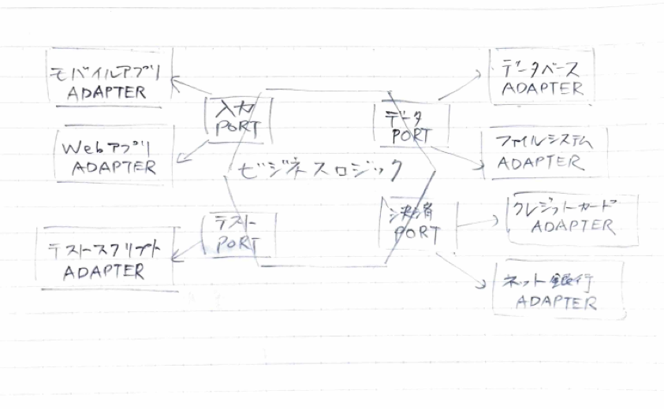

# ポート&アダプター

ポート&アダプターとは、ビジネスロジックを外部の技術的詳細から切り離すためのアーキテクチャパターン。

Alistair Cockburn が2005年に提唱。六角形（ヘキサゴナル）アーキテクチャとも呼ばれる。

## 背景

レイヤードアーキテクチャでは、上位層が下位層に依存する一方向の階層構造をとる。この構造では、ビジネスロジック層がデータアクセス層の具体的な実装に依存してしまい、データベースの変更がビジネスロジックに波及する問題があった。

ポート&アダプターは、この依存関係を逆転させることで、ビジネスロジックがどの外部技術にも依存しない構造を実現する。

## 構成要素

### ビジネスロジック（コア）

アプリケーションの中心に位置する、純粋なドメインロジック。外部の技術的な詳細を一切知らない。

### ポート

ビジネスロジックが外部とやり取りするためのインターフェース（境界）。

* 入力ポート（ドライビングポート） — 外部からビジネスロジックを呼び出すためのインターフェース。ビジネスロジックが実装を提供する
* 出力ポート（ドリブンポート） — ビジネスロジックが外部リソースを利用するためのインターフェース。ビジネスロジックが定義し、アダプターが実装する

### アダプター

ポートの具体的な実装。外部技術とポートの間を変換する。

* 入力アダプター（ドライビングアダプター） — Web アプリ、モバイルアプリ、テストスクリプトなど。入力ポートを通じてビジネスロジックを駆動する
* 出力アダプター（ドリブンアダプター） — データベース、ファイルシステム、決済サービスなど。出力ポートを実装し、外部リソースへのアクセスを担う

## 依存の方向

すべての依存は外側（アダプター）から内側（ビジネスロジック）に向かう。ビジネスロジックはポートというインターフェースだけを知っており、その先に何が接続されているかを知らない。

この構造により、アダプターの差し替えだけで以下のようなことが可能になる。

* データベースを MySQL から PostgreSQL に変更する
* Web UI をモバイルアプリに置き換える
* 本番の決済サービスをテスト用のモックに差し替える

## レイヤードアーキテクチャとの比較

| 観点 | レイヤード | ポート&アダプター |
|---|---|---|
| 依存の方向 | 上位層 → 下位層（一方向） | 外側 → 内側（依存性逆転） |
| ビジネスロジックの依存先 | データアクセス層の実装 | ポート（インターフェース）のみ |
| 外部技術の交換 | 層をまたいで影響が波及しやすい | アダプターの差し替えで完結する |
| テスト容易性 | DB 等の外部依存を含みやすい | アダプターをモックに差し替えて単体テスト可能 |
