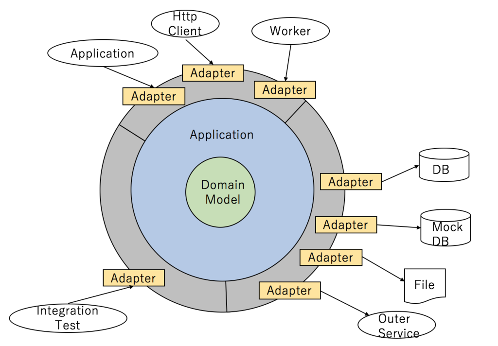
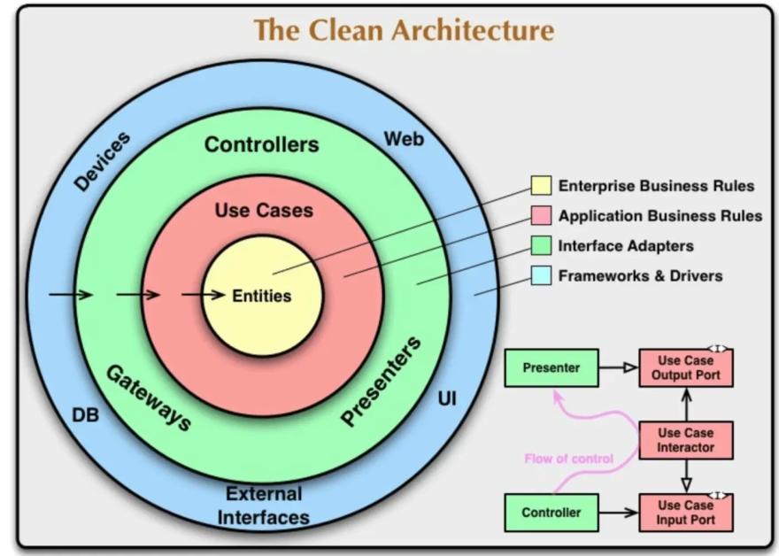

# クリーンアーキテクチャ

## クリーンアーキテクチャとは
ソフトウェアを関心事に応じて複数の層状に隔離して記述することで、保守性、拡張性の高い構造を保つ設計原則。

## 背景

Robert C. Martin (Uncle Bob) が 2012 年に提唱。ポート&アダプターやオニオンアーキテクチャなど、先行する複数のパターンから共通原則を抽出し、一つの図と用語体系に統合・整理したもの。

### 先行パターンからの流れ

ポート&アダプター（Cockburn, 2005）は、ビジネスロジックと外部技術をポート／アダプターで分離するという考え方を確立した。ただし、ビジネスロジック内部の構造化（層の分け方や依存の方向）については規定していなかった。

オニオンアーキテクチャ（Jeffrey Palermo, 2008）は、この考え方を同心円のレイヤー図として具体化した。

* Domain Model → Domain Services → Application Services → Infrastructure という層構造を定義した
* 依存の方向を「外側から内側へ」と明示的にルール化した
* ドメインモデルを最も内側に置き、インフラストラクチャを最も外側に配置する構造を示した

クリーンアーキテクチャは、これらの先行パターンに共通する原則（依存の内向き制約、ドメイン中心の同心円構造）を統合した上で、以下を加えたものとなる。

* 用語体系の統一: Entities / Use Cases / Interface Adapters / Frameworks & Drivers
* 層の境界を越えるデータの受け渡し規約の定義

境界越えの規約では、内側の層が外側のデータ構造に依存しないように、以下の仕組みを用いる。

* Input Boundary — Use Case を呼び出すためのインターフェース。外側の Controller がこれを通じて Use Case を駆動する
* Output Boundary — Use Case が結果を外側に返すためのインターフェース。Presenter がこれを実装する
* DTO（Data Transfer Object）— 境界を越えてデータを運ぶプレーンなオブジェクト。エンティティをそのまま外側に露出させず、層間の結合を防ぐ

## 図

## 構成要素

依存の向きは常に外側から内側へ。ビジネスロジックを最も内側に置き、技術的な詳細を外側に配置する。

### Entities 層（ドメイン層）

エンティティ、値オブジェクト、ドメインイベントなど、アプリケーションに依存しない純粋なビジネスルールを記述する。フレームワークや外部ライブラリへの依存を持たず、最も変更頻度が低い層となる。

### Use Cases 層

アプリケーション固有のビジネスルールを記述する。エンティティを操作して特定のユースケースを実現する。Input Boundary を通じて入力を受け取り、Output Boundary を通じて結果を外側に返す。

### Interface Adapters 層（Controllers / Presenters / Gateways）

外部のデータ形式と内部のデータ形式を相互変換する。Controller は HTTP リクエストを Use Case の入力に変換し、Presenter は Use Case の出力をビューモデルに変換する。Gateway はデータベースや外部 API のレスポンスをエンティティに変換する。

### Frameworks & Drivers 層

Web フレームワーク、データベースドライバ、UI ライブラリなど、具体的な技術の実装を配置する。この層のコードは薄く、Interface Adapters への橋渡しが主な役割となる。

## 依存性の向き

外側の層が内側の層に依存し、内側は外側を知らない。この制約を実現するために、依存性逆転の原則（DIP, SOLID 原則の一つ）を適用する。

具体的には、内側の層がインターフェース（Port）を定義し、外側の層がその実装（Adapter）を提供する。たとえば Use Cases 層がリポジトリインターフェースを定義し、Frameworks & Drivers 層がデータベースを使った具体的な実装を注入する。これにより、内側の層はデータベースの種類や通信方法といった技術的詳細に依存しなくなる。

## レイヤードアーキテクチャとの比較

レイヤードアーキテクチャでは、プレゼンテーション層 → ビジネスロジック層 → データアクセス層と上位が下位に依存する。この構造ではビジネスロジックがデータベースの具体的な実装に依存してしまう。

クリーンアーキテクチャでは依存の方向が「外側から内側」に統一され、ビジネスロジック（Entities / Use Cases）はデータベースや UI といった外側の技術的詳細に一切依存しない。外部技術の変更がビジネスロジックに波及しないため、テスト容易性と技術選択の柔軟性が向上する。